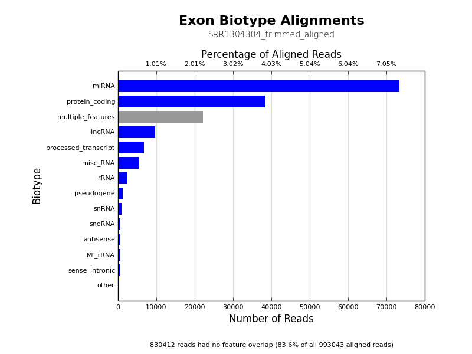
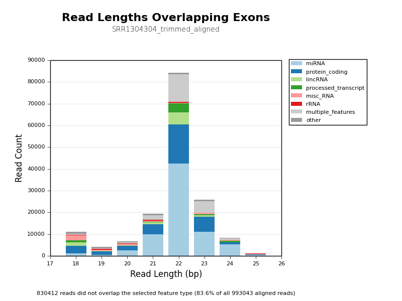
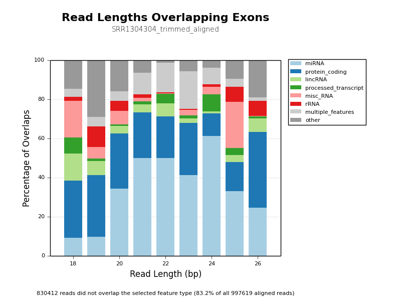

# Count Biotypes

This script takes an aligned BAM file and counts the overlaps with
different biotype flags within a GTF annotation file.

Annotation GTF (Gene Transfer Format) files can contain information about
coding sequences within the genome. In addition to specifying feature type
and position, GTF features can have associated annotation fields. One such
field is *biotype*, typically denoted by the `gene_type` or `biotype` flag
(see the [GENCODE format specifications of biotype flags](http://www.gencodegenes.org/gencode_biotypes.html).)

To get an overview of where reads from a next-generation sequencing library
are aligned within your reference genome, it can be interesting to annotate
overlaps with different types of features - for instance `rRNA` genes,
`protein_coding` genes and `miRNA` transcripts. This script does just that,
generating plots which show the frequency with which different biotype labels
are overlapped and how these overlaps are distributed throughout different
alignment lengths.

The script is written in Python and can be run on the command line or imported into another python script. Overlaps are measured using the [HTSeq library](http://www-huber.embl.de/users/anders/HTSeq/).

## Example output
The following plots were generated from a Total Small RNA run in Human cells,
accession [SRR1304304](http://www.ncbi.nlm.nih.gov/sra/?term=SRR1304304).








## Usage

On the command line:
```bash
python count_biotypes.py -g <annotation.gtf> <aligned_1.bam> .. <aligned_n.bam>
```

Within a python script:

```python
import count_biotypes
count_biotypes.count_biotypes(annotation_file_path_, input_bam_file_paths):
```

If importing, individual functions can be called for a more 
fine-grained approach:

```python
(ftrs, bt_cts, bt_lnths) = count_biotypes.parse_gtf_biotypes(annotation_file_path)
(counts, lengths, output) = count_biotype_overlaps (aligned_bam, ftrs, bt_cts, bt_lnths)
(bargraph_png_fn, bargraph_pdf_fn) = plot_bars(counts, fn_basename)
(hist_png_fn, hist_pdf_fn) = plot_epic_histogram (lengths, fn_basename)
```

### Translations
To customise the plots, it is possible to "translate" biotype labels. A file
called `bt_translations.txt` comes with the script - each line can contain a
search pattern and a replacement label (tab separated). Search wildcards can be
included by using an asterisk (`*`). Multiple search strings can be given the
same biotype label to manually group biotypes together.

## Parameters

Arguments shown in order received by `count_biotypes()`.

Command Line Flag | `count_biotypes()` argument name | Description
----------------- | -------------------- | -----------
`-g`, `--genome-feature-file` | `annotation_file` | Required.<br>Path to annotation file.
`<input_bam_list>` | `input_bam_list` | Required.<br>List of paths to aligned BAM files.
`-t`, `--genome-feature` | `feature_type` | Default: `exon`.<br>Feature type for transcribed regions (for which biotypes will be counted).
`-b`, `--biotype-flag` | `biotype_flag` | Default: `gene_type` (will also look for any flag containing `biotype`).<br>Name of annotation flag to collect biotype label from.
`-n`, `--num-lines` | `num_lines` | Default: 10 million.<br>Number of lines to read from aligned BAM file.
`-o`, `--no-overlap` | `no_overlap` | Default: False.<br>Include features with no feature overlap in plots.
`-c`, `--cols` | `equidistant_cols` | Default: False.<br>Plot graphs using equidistant colours to prevent duplicated label colours.
`-l`, `--log` | `log_level` | Default: info.<br>Specify the level of logging: debug, info or warning.
`-u`, `--log-output` | `log_output` | Default: stdout.<br>Log output filename.

## Dependencies

The script is written in Python. The following libraries are required:

* [HTSeq](http://www-huber.embl.de/users/anders/HTSeq/)
* [matplotlib](http://matplotlib.org/)
* [numpy](http://www.numpy.org/)
* argparse
* collections (defaultdict)
* logging
* os

## Credits
These scripts were written for use at the 
[National Genomics Infrastructure](https://portal.scilifelab.se/genomics/)
at [SciLifeLab](http://www.scilifelab.se/) in Stockholm, Sweden. They are 
part of a larger repository of
[Visualization Scripts](https://github.com/SciLifeLab/visualizations).

For more information, please get in touch with
[Phil Ewels](https://github.com/ewels).

<p align="center"><a href="http://www.scilifelab.se/" target="_blank"></a></p>

