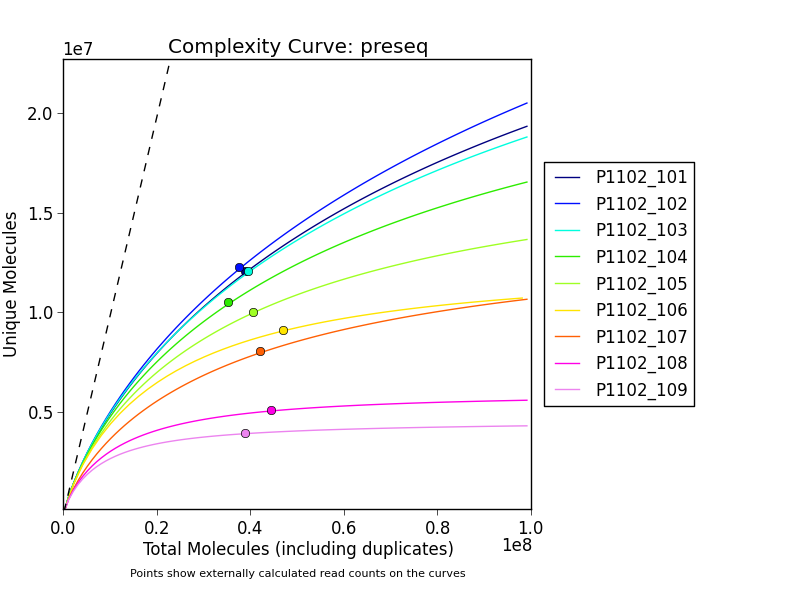
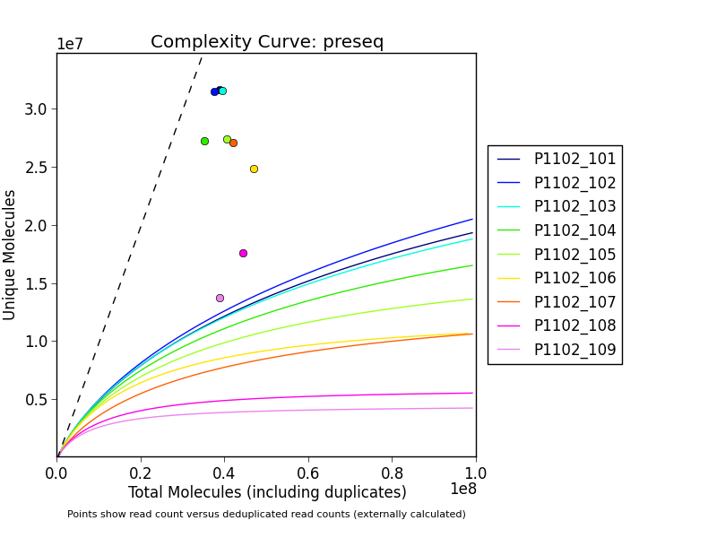

# preseq Complexity Curves
[Preseq](http://smithlabresearch.org/software/preseq/) is a piece of software
designed to estimate how library complexity varies with increasing sequencing
depth. It helps to decide whether further sequencing would yield further
information.

The output from preseq is purely text. This script takes a number of preseq
output files and plots them using the Python matplotlib package. Optionally,
a file can be provided with read counts, which will be plotted on the lines
to show to what depth the current libraries have been sequenced. This file
can contain two columns of numbers, for instance if unique reads have been
calculated using a different method (_eg._ Picard).

Note that preseq uses a different method to calculate how many unique molecules
there are to most duplicate removal tools. See [this seqanswers thread](http://seqanswers.com/forums/showthread.php?t=27798&page=2)
for more information.

## Example output
Plotting points with read counts versus interpolated unique read counts (from preseq):


Plotting points with read counts versus deduplicated read counts (using Picard):


## Usage

This tool is a python script and should be run on the command line as follows:

```bash
python plot_complexity_curves.py *.preseq
```

### Plotting the "real" data
To the real data as points, a file contaning the read counts must be referenced
using the `-r` argument. You can generate such a file using [samtools](http://www.htslib.org/)
with the following command:
```
echo "Sample_1 "$(samtools view -c -F 4 Sample_1.bam)
```

If you would like to count two files - one with and one without duplicates,
you can execute the following:
```
echo "Sample_1 "$(samtools view -c -F 4 Sample_1.bam)" "$(samtools view -c -F 4 Sample_1_dedup.bam)
```

The file should have at least two columns - the first being the input filename
and the second being the read counts (space delimited). The third optional
column with unique counts is optional.

### Using coverage instead of read counts
Preseq reports its numbers as "Molecule counts". This isn't always very intuitive, and it's
often easier to talk about sequencing depth in terms of coverage.

You can plot with approximate coverage on the axes instead by using the `--coverage`
and `--read-length` command line parameters. `--coverage` should be followed by the length
of your reference genome in base pairs. These parameters make the script take every molecule
count and divide it by (`genome-length / read-length`).

## Parameters

Arguments shown in order received by `plot_complexity_curves()`.

Command Line Flag | `plot_complexity_curves()` argument name | Description
----------------- | -------------------- | -----------
`<preseq_files>` | `ccurves` | Required.<br>List of paths to preseq output files.
`-c`, `--coverage` | `coverage` | Default: none.<br>Plot coverage instead of read counts. Supply with reference genome length (bp).
`-l`, `--read-length` | `read_length` | Default: none.<br>Length of sequenced reads, to be used with `--coverage`
`-r`, `--real-counts` | `real_counts_path` | Default: none.<br>Path to file with read counts.
`-o`, `--output-name` | `output_name` | Default: `complexity_curves`.<br>Output file name
`-m`, `--x-min` | `x_min` | Default: `0`.<br>Minimum x axis limit.
`-x`, `--x-max` | `x_max` | Default: 500 million.<br>Maximum x axis limit.
`-h`, `--help` | - | Display full help text.

## Dependencies

The script is written in Python. The following libraries are required:

* [matplotlib](http://matplotlib.org/)
* [numpy](http://www.numpy.org/)
* [pandas](http://pandas.pydata.org/)
* argparse
* glob
* os
* subprocess
* sys
* yaml


## Credits
These scripts were written for use at the
[National Genomics Infrastructure](https://portal.scilifelab.se/genomics/)
at [SciLifeLab](http://www.scilifelab.se/) in Stockholm, Sweden. They are
part of a larger repository of
[NGI Visualization Scripts](https://github.com/SciLifeLab/ngi_visualizations).

For more information, please get in touch with
[Phil Ewels](https://github.com/ewels).

<p align="center"><a href="http://www.scilifelab.se/" target="_blank"></a></p>
