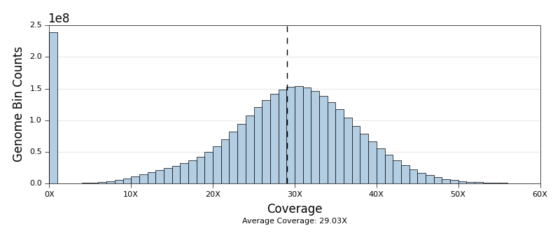

# Qualimap Plots

[Qualimap](http://qualimap.bioinfo.cipf.es/) is a tool to
_"facilitate the quality control of alignment sequencing data"_.

Whilst it produces nice plots out of the box, we have created some scripts
to re-plot some of the data to give a more consistent feel to the output.
We also split some of the plots up into per-chromosome graphs to give
a better view of the data.

## Coverage Histogram
Replacement plot for the Qualimap
[Coverage Histogram (0-50X)](http://kokonech.github.io/qualimap/HG00096.chr20_bamqc/images_qualimapReport/genome_coverage_0to50_histogram.png).
Essentially just stylistic changes - larger axis labels, different colours,
different aspect ratio and so on.

## Coverage Histogram
Replacement plot for the Qualimap
[Insert Size Histogram](http://kokonech.github.io/qualimap/HG00096.chr20_bamqc/images_qualimapReport/genome_insert_size_histogram.png).

## Usage
Both scripts work on the command line and take the raw Qualimap output as
inputs:

    coverage_histogram.py coverage_histogram.txt
    insert_size.py insert_size_histogram.txt

`coverage_histogram.txt` and `insert_size_histogram.txt` are generated
by [Qualimap](http://qualimap.bioinfo.cipf.es/) and can typically be found in
`raw_data_qualimapReport` report output folder.

## Parameters
Parameters are very similar, so shown in one table. Defaults are for the
coverage histogram and insert size histograms, respectively.

Command Line Flag | Description
----------------- | -------------------- | -----------
`<input>` | Required. Qualimap output. See above.
`-o`, `--output` | Default: `coverage` / `insert_size` Plot output filename base. 
`-x`, `--min_x` | Default: `0` or `None` Minimum x limit. `None` to use data limit.
`-m`, `--max_x` | Default: `60` or `None` Maximum x limit. `None` to use data limit.
`-b`, `--output` | Default: `10` Bin size for histogram.  Insert Size Histogram only.
`-l`, `--log` | Default: `info` Level of log messages to display. Can be `debug`, `info` or `warning`.
`-u`, `--log-output` | Default: `stdout` Log output filename.
`-h`, `--help` | Display the help.

## Dependencies

These scripts are written in Python and run on the command line. They require
output generated by [Qualimap](http://qualimap.bioinfo.cipf.es/).

The following Python libraries are required:

* [matplotlib](http://matplotlib.org/)
* argparse
* logging
* os

## Credits
These scripts were written for use at the 
[National Genomics Infrastructure](https://portal.scilifelab.se/genomics/)
at [SciLifeLab](http://www.scilifelab.se/) in Stockholm, Sweden. They are 
part of a larger repository of
[Visualization Scripts](https://github.com/SciLifeLab/visualizations).

For more information, please get in touch with
[Phil Ewels](https://github.com/ewels).

