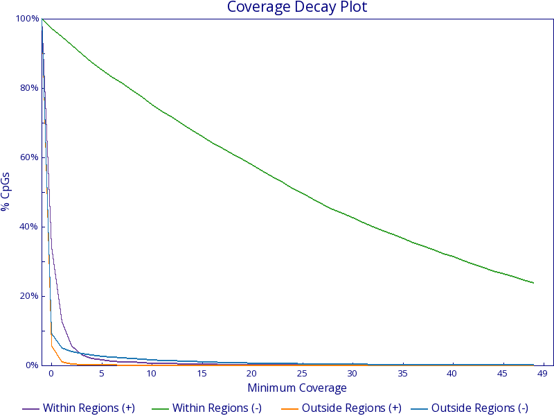
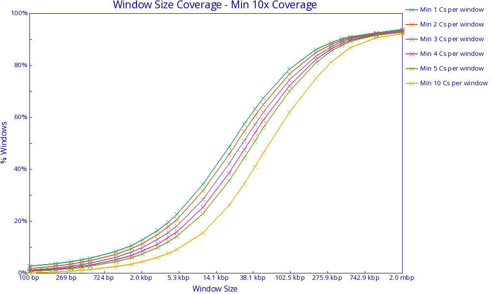
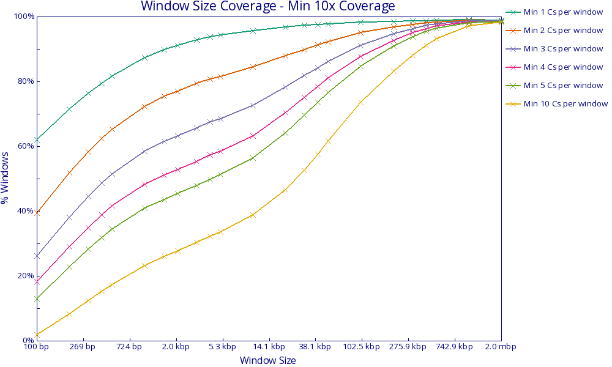

# Bismark Coverage Curves

[Bismark](http://www.bioinformatics.babraham.ac.uk/projects/bismark/) is a tool
used for aligning Bisfulfite-Sequencing libraries, giving information about
DNA methylation.

Amongst other things, Bismark can generate coverage reports which state the
number of observations made of each Cytosine. This script takes these reports
as input and plots the proportion of cytosines seen at increasing levels of 
fold coverage.

This is useful as when analysing BS-Seq data it's important to set a coverage
threshold to avoid low observations skewing percentage information. These plots
help to choose an appropriate cut-off.

Additional options allow you to interrogate coverage on different reference
strands and within regions of interest, as specified by a BED file.

## Example Output


See additional [text output](../../examples/coverageStats.txt)


## Usage

```bash
perl bismark_coverage_curves.pl <coverage_file.cov>
```

For nicer fonts, download the [OpenSans-Regular.ttf](https://github.com/ewels/visualizations/raw/master/OpenSans-Regular.ttf)
font into the same directory as the script. Font is from [Google Fonts](https://www.google.com/fonts/specimen/Open+Sans).

## Parameters

This script is run on the command line. The following commands control how
it runs.

Command Line Flag | Description
----------------- | -----------
`--regions <regions.bed>` | Default: None<br>Supply a BED file with regions of interest. The script will show coverage inside and outside these regions
`--stranded` | Default: No.<br>Split the report up into forward and reverse strands
`--min_cov` | Default: `0x`.<br>The minimum coverage limit to consider / plot
`--max_cov` | Default: `15x`; `50x` if `--regions` is set.<br>The maximum coverage limit to consider / plot
`--binsize` | Default: `1`.<br>The coverage bin size to use - what size steps to use between `--min_cov` and `--max_cov`
`--numlines` | Default: `1000000`.<br>Number of lines to process. More lines gives more accuracy but takes longer to run. Note: if the imput is sorted and your sample biased it's a good idea to specify a large number.
`--append` | Default: `_coverageStats.txt`.<br>String to append to results filenames
`--quiet` | Suppress status messages
`--help` | Print help message

## Dependencies

The script is written in Perl and run on the command line. The following
core Perl modules are required for generating the numbers:

* [Getopt::Long](http://perldoc.perl.org/Getopt/Long.html)
* [POSIX](http://perldoc.perl.org/POSIX.html)
* [FindBin](http://perldoc.perl.org/FindBin.html)

To plot the graphs, you'll also need the following modules:

* [GD::Graph](http://search.cpan.org/dist/GDGraph/Graph.pm) (lines and colour)
* [GD::Image](http://search.cpan.org/dist/GD/GD.pm)


---------------------------------------------------------------------------


# Bismark Window Sizes

[Bismark](http://www.bioinformatics.babraham.ac.uk/projects/bismark/) is a tool
used for aligning Bisfulfite-Sequencing libraries, giving information about
DNA methylation.

In addition to setting coverage thresholds for individual cytosines, it can
help to set thresholds for the number of different cytosines to be counted
within each window. This script takes coverage reports as input and plots the
percentage of windows retained at increasing window sizes.

Additional options allow you to restrict included cytosines to a specific
reference strand, define a coverage threshold for each cytosine for it to
be considered, the number of different cytosines passing the coverage
threshold for a window to be counted as well as restricting the 
windows to those overlapping regions of interest, as specified by a BED file.

## Example Output




See additional text output: [first plot](../../examples/windowSizes_wholeGenome.txt), [second plot](../../examples/windowSizes_roi.txt)

## Usage

```bash
perl bismark_window_sizes.pl <coverage_file.cov>
```

For nicer fonts, download the [OpenSans-Regular.ttf](https://github.com/ewels/visualizations/raw/master/OpenSans-Regular.ttf)
font into the same directory as the script. Font is from [Google Fonts](https://www.google.com/fonts/specimen/Open+Sans).

## Parameters

This script is run on the command line. The following commands control how
it runs.

Command Line Flag | Description
----------------- | -----------
`--regions <regions.bed>` | Default: None<br>Supply a BED file with regions of interest. Only reads and windows overlapping these regions will be considered.
`--stranded <for / rev>` | Default: both.<br>Consider reads on only one reference strand
`--coverage` | Default: `10x`.<br>Minumum number of observations required to count a Cytosine
`--min_counts <comma separated integers>` | Default: `1,2,3,4,5,10`.<br>List of count thresholds to use - how many different cytosines must be seen within a window for it to pass
`--window_sizes <comma separated integers, bp>` | Default: `100bp,200bp,300bp,400bp,500bp,1kbp,1.5kbp,2kbp,3kbp,4kbp,5kbp,10kbp,20kbp,30kbp,40kbp,50kbp,100kbp,200kbp,300kbp,400kbp,500kbp,1mbp,2mbp`.<br>Window sizes to use. Specify in base pairs.
`--append` | Default: `_coverageStats.txt`.<br>String to append to results filenames
`--quiet` | Suppress status messages
`--help` | Print help message

## Dependencies

The script is written in Perl and run on the command line. The following
core Perl modules are required for generating the numbers:

* [Getopt::Long](http://perldoc.perl.org/Getopt/Long.html)
* [POSIX](http://perldoc.perl.org/POSIX.html)
* [FindBin](http://perldoc.perl.org/FindBin.html)

To plot the graphs, you'll also need the following modules:

* [GD::Graph](http://search.cpan.org/dist/GDGraph/Graph.pm) (linespoints and colour)
* [GD::Image](http://search.cpan.org/dist/GD/GD.pm)


## Credits
These scripts were written for use at the 
[National Genomics Infrastructure](https://portal.scilifelab.se/genomics/)
at [SciLifeLab](http://www.scilifelab.se/) in Stockholm, Sweden. They are 
part of a larger repository of
[NGI Visualization Scripts](https://github.com/SciLifeLab/ngi_visualizations).

For more information, please get in touch with
[Phil Ewels](https://github.com/ewels).

<p align="center"><a href="http://www.scilifelab.se/" target="_blank"></a></p>


