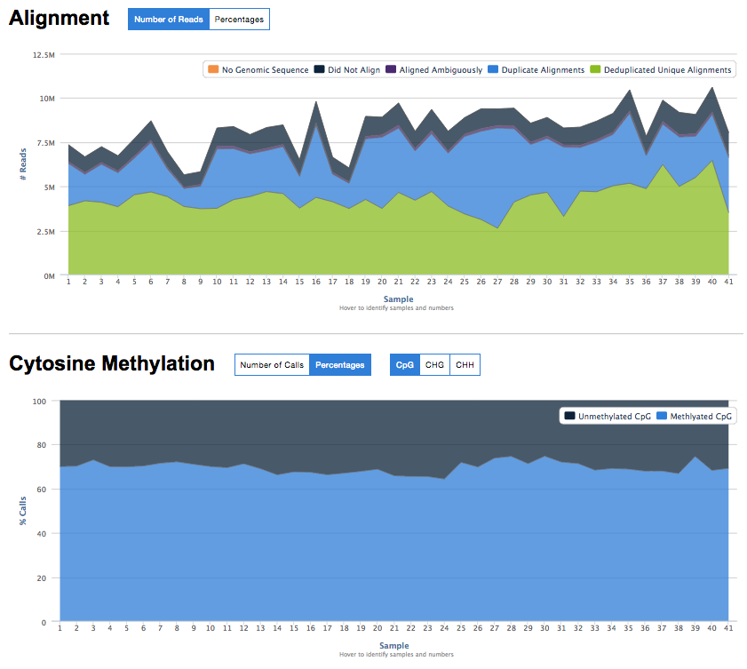

# Bismark Summary Reports

[Bismark](http://www.bioinformatics.babraham.ac.uk/projects/bismark/) is a tool
used for aligning Bisfulfite-Sequencing libraries, giving information about
DNA methylation.

For every sample that is analysed, Bismark produces statistics such as alignment
rates and methylation calls. A report is generated to show this data, fantastic
for interrogating single samples. It is of less use when a large number of samples
are processed in parallel, however (as is increasingly the norm).

This script takes a list of bismark-processed BAM files as an input, looks for the
corresponding bismark reports and produces a HTML summary report. The report is
interactive, allowing the data to be plotted with absolute counts or percentages.
Methylation calls can be shown in CpG, CHG and CHH context.

In addition to the HTML report, a text file is generated with tab delimited numbers
for post-processing.

## Example Output

See the full example report here: [bowtie_report.html](https://rawgit.com/ewels/visualizations/master/examples/bismark_summary_report.html)

See also the additional [text output](../../examples/coverageStats.txt)

## Usage

```bash
perl bismark_summary_report.pl *.bam
```

## Parameters

This script is run on the command line. There are currently no customisation
options.

## Dependencies

The script is written in Perl and run on the command line.

## Credits
Theis script was written for use at the
[National Genomics Infrastructure](https://portal.scilifelab.se/genomics/)
at [SciLifeLab](http://www.scilifelab.se/) in Stockholm, Sweden. They are
part of a larger repository of
[NGI Visualization Scripts](https://github.com/SciLifeLab/ngi_visualizations).

For more information, please get in touch with
[Phil Ewels](https://github.com/ewels).

<p align="center"><a href="http://www.scilifelab.se/" target="_blank"></a></p>
