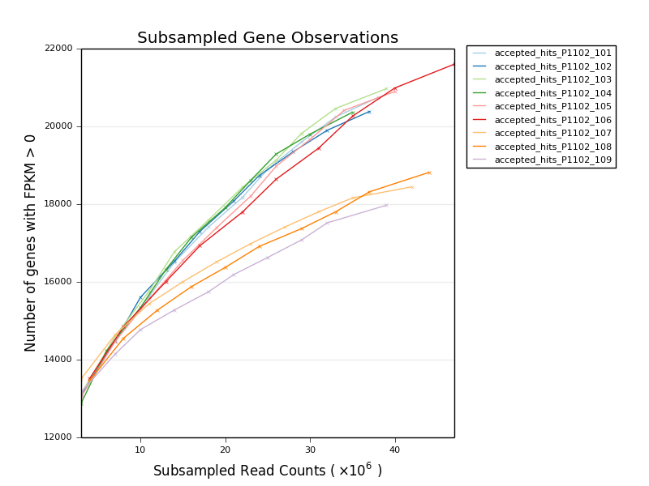

# Subsampled Gene Observations

Software such as [Preseq](http://smithlabresearch.org/software/preseq/) can
show how sequencing library diversity changes with increasing sequencing 
depth. This tool is an attempt to generate a similar metric using a measurement
which is more biologically relevant for RNA-Sequencing datasets: the number
of different genes which have been observed _(default: FPKM > 0)_.

The package is comprised of four scripts which must be run separately:

* `submit_subsample_jobs.sh`: Subsample a set of aligned BAM files using [Picard](http://picard.sourceforge.net/command-line-overview.shtml#DownsampleSam)
* `submit_cufflinks_jobs.sh`: Count the FPKM gene counts using [Cufflinks](http://cufflinks.cbcb.umd.edu/)
* `count_aligned_reads.sh`: Count the aligned reads in the subsampled BAM files using [samtools](http://samtools.sourceforge.net/)
* `plot_observed_genes.py`: A Python script which takes this output and plots a graph.

**Note:** The first two scripts are currently written to work with our setup
in SciLifeLab, and will require modification to run on different systems.

## Example output


## Step 1: Subsample the BAM files
```bash
bash submit_subsample_jobs.sh *.bam
```
This will set off SLURM sbatch jobs to create 9 subsampled files for each
input BAM file (10% to 90% in 10% steps). A soft-link is created for the
original file so that there is a file for the 100% step.

The script will check for existing files and skip that step if the target
file already exists. As such, if some jobs fail you can run the script
again to fill in the gaps.

Command Line Flag | Description
----------------- | ------------
`-l` | Directory for log files. Default: `./logs/`
`-o` | Directory for output. Default: `./downsampled/`

## Step 2: Cufflinks analysis
Once the subsampling is complete, cufflinks must be run on each file.
```bash
bash submit_cufflinks_jobs.sh -b <fasta reference> -g <gtf reference> *.bam
```
This will create jobs for the cufflinks analysis. As with the subsampling
script, the script will check for existing files and any where the target
file already exists. As such, if some jobs fail you can run the script
again to fill in the gaps.

Command Line Flag | Description
----------------- | ------------
`-b` | FASTA reference file. Required.
`-g` | GTF reference file. Required.
`-l` | Directory for log files. Default: `./logs/`
`-o` | Directory for output. Default: `./cufflinks/`
`-n` | Number of cores to use. Default: `1`

## Step 3: Count Reads _(optional)_
If you would like the plot the number of detected genes versus actual subsampled
read counts (as shown in the example above), you need to count the aligned
reads in each BAM file. This script uses samtools to count the reads in each
input and output a tab-delimited file with filename and read count.

**Note**: You can skip this step and just plot the x
axis as percentages instead of read counts - just omit the `-c` paramter when
running the plotting script.

```bash
bash count_aligned_reads.sh *.bam
```

Command Line Flag | Description
----------------- | ------------
`-o` | Directory for output file. Default: `./read_counts.txt`

## Step 4: Plotting
Finally, submit the directories of the completed cufflinks analysis to the
plotting script:
```bash
python plot_observed_genes.py *_cufflinksAnalysis/
```
The script will parse the directory names, assuming the structure
`<sample_name>_<subsample_proportion>`. Next, it will go through the
directories looking for a file called `genes.fpkm_tracking`. It will open
this and loop through each line (each gene) and count those where the FPKM
is greater than the specified threshold (default: `0`).

If a read counts file is specified with `-c`, the script will attempt to find
a read count for each subsample point and use this value on the x axis.

Finally, the script creates a plot using the proportions as the x axis.

Command Line Flag | Description
----------------- | -------------------- | -----------
`<input directories>` | Required.<br>List of cufflinks results directories
`-f`, `--fpkm-cutoff` | Default: `0`<br> Cutoff at which to count genes as observed.
`-c`, `--read-counts` | Default: `None`<br> File containing BAM file read counts, used for x axis instead of percentages. See Step 3.
`-o`, `--output` | Default: `gene_counts`<br>Plot output filename base. Default: `gene_counts.png` / `.pdf`
`-l`, `--log` | Default: `info`<br>Level of log messages to display. Can be `debug`, `info` or `warning`.
`-u`, `--log-output` | Default: `stdout`<br>Log output filename.

## Dependencies
The scripts are written in bash and Python. 
[Picard](http://picard.sourceforge.net/),
[Cufflinks](http://cufflinks.cbcb.umd.edu/) and
[samtools](http://samtools.sourceforge.net/) must be installed for the first
three steps.

The following Python libraries are required:

* [matplotlib](http://matplotlib.org/)
* argparse
* collections (defaultdict)
* logging
* os
* re

## Credits
These scripts were written for use at the 
[National Genomics Infrastructure](https://portal.scilifelab.se/genomics/)
at [SciLifeLab](http://www.scilifelab.se/) in Stockholm, Sweden. They are 
part of a larger repository of
[Visualization Scripts](https://github.com/SciLifeLab/visualizations).

For more information, please get in touch with
[Phil Ewels](https://github.com/ewels).

<p align="center"><a href="http://www.scilifelab.se/" target="_blank"></a></p>


